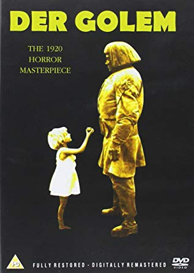

# HORROR-FILMS.github.io
<h1> HORROR </h1>
<h2>Horror Films </h2>

Horror Films are unsettling films designed to frighten and panic, cause dread and alarm, and to invoke our hidden worst fears, often in a terrifying, shocking finale, while captivating and entertaining us at the same time in a cathartic experience. Horror films effectively center on the dark side of life, the forbidden, and strange and alarming events. They deal with our most primal nature and its fears: our nightmares, our vulnerability, our alienation, our revulsions, our terror of the unknown, our fear of death and dismemberment, loss of identity, or fear of sexuality.

<h3> The contents of this page : </h3>
<ol><li> Introduction to Horror Films Genre: </li>
  <li>Early Vampire Films: </li>
  <li>Early Monster (Frankenstein) Films: </li></ol>
<h2>Introduction to Horror Films Genre: </h2>
 
Horror films go back as far as the onset of films themselves, over a 100 years ago. From our earliest days, we use our vivid imaginations to see ghosts in shadowy shapes, to be emotionally connected to the unknown and to fear things that are improbable. Watching a horror film gives an opening into that scary world, into an outlet for the essence of fear itself, without actually being in danger. Weird as it sounds, there's a very real thrill and fun factor in being scared or watching disturbing, horrific images.

Horror films, when done well and with less reliance on horrifying special effects, can be extremely potent film forms, tapping into our dream states and the horror of the irrational and unknown, and the horror within man himself. (The best horror films only imply or suggest the horror in subtle ways, rather than blatantly displaying it, i.e., Val Lewton's horror films.) In horror films, the irrational forces of chaos or horror invariably need to be defeated, and often these films end with a return to normalcy and victory over the monstrous.

Of necessity, the earliest horror films were Gothic in style - meaning that they were usually set in spooky old mansions, castles, or fog-shrouded, dark and shadowy locales. Their main characters have included "unknown," human, supernatural or grotesque creatures, ranging from vampires, demented madmen, devils, unfriendly ghosts, monsters, mad scientists, "Frankensteins," "Jekyll/Hyde" dualities (good against evil), demons, zombies, evil spirits, arch fiends, Satanic villains, the "possessed," werewolves and freaks to even the unseen, diabolical presence of evil.

<h2>The Earliest  Vampire Films: </h2>

Female vamps made an appearance in Robert Vignola's melodramatic The Vampire (1913), although they were femme fatales who seductively 'sucked' the life-blood from 'foolish' men -- also exemplified by popular vamp actress Theda Bara in A Fool There Was (1915). The earliest significant vampire film was director Arthur Robison's German silent film Nachte des Grauens (1916, Ger.) (aka Night of Horror) with strange, vampire-like people. Until recently, the lost Hungarian film Drakula halala (1921, Hung.) (aka The Death of Dracula), was widely assumed to be the first adaptation of Anglo-Irish writer Bram Stoker's 1897 vampire novel Dracula, and featured cinema's first Drakula.

Nosferatu - 1922The first genuine vampire picture was also produced by a European filmmaker - director F. W. Murnau's feature-length Nosferatu, A Symphony of Horror (1922, Ger.) (aka Nosferatu, eine Symphonie des Grauens). Shot on location, it was an unauthorized film adaptation of Stoker's Dracula with Max Schreck in the title role as the screen's first vampire - a mysterious aristocrat named Count Graf Orlok living in the late 1830s in the German town of Bremen. Because of copyright problems, the vampire was named Nosferatu rather than Dracula, and the action was moved from Transylvania to Bremen. The emaciated, balding, undead vampire's image was unforgettable with a devil-rat face, pointy ears, elongated fingers, sunken cheeks, and long fangs, with plague rats following him wherever he went. In the film's conclusion, the grotesque, cadaverous creature was tricked by the heroine Nina (Greta Schroder) into remaining past daybreak, so Orlok met his fate by disintegrating into smoke in the sunlight.

<h2>Early Monster (Frankenstein) Films:  </h2>

In Danish director Stellan Rye's and Paul Wegener's early German silent horror film Der Student von Prag (1913, Ger.) (aka The Student of Prague/A Bargain With Satan), based loosely upon the Faust legend, a poor student made a pact with the devil in return for wealth and a beautiful woman. [The student was portrayed by actor/producer/director Paul Wegener in his film debut.] It was the first artistically important German production - and was later remade in 1926 and directed by Henrik Galeen. Wegener directed the first of his influential adaptations of the Golem legend by Gustav Meyrinck - Der Golem (1914, Ger.) (aka The Monster of Fate), and then remade it a few years later as Der Golem Und Die Tanzerin (1917, Ger.) (aka The Golem and the Dancer) - notably the first horror film sequel. He remade the film a third time, with Karl Freund as cinematographer, again titling it Der Golem (1920, Ger.) (aka The Golem: or How He Came Into the World). The expressionistic film was based upon Central European myths and influenced later 'Frankenstein' monster films in the early 1930s with themes of a creator losing control of his creation. The Golem, played by Wegener, was an ancient clay figure from Hebrew mythology that was brought to life by Rabbi Loew's magic amulet to defend and save the Jews from a pogrom in the 16th century threatened by Rudolf II of Habsburg. The man-made, clay creature roamed through the Jewish ghetto of medieval Prague to protect it from persecution.

The earliest horror pictures were one-reel or full length features, many of which were produced in the US from 1909 to the early 1920s, making the horror genre one of the oldest and most basic. Many of them are now-forgotten "vamp" pictures (featuring devilish, captivating ladies). The first Frankenstein monster film in the US was Frankenstein (1910) by director J. Searle Dawley, a 16-minute (one-reel) version made by the Edison Studios and starring Charles Ogle as the monster. In this early version, the Monster was created in a cauldron of chemicals rather than by a bolt of lightning. Two other silent precursors to later Frankenstein films were Joseph W. Smiley's Life Without Soul (1915) and the expressionistic German film Homunculus (1916), a six-hour epic serial about an artificially-created man. Before the 1930s, Hollywood was reluctant to experiment with the themes of true horror films. Instead, the studios took popular stage plays and emphasized their mystery genre features, providing rational explanations for all the supernatural and occult elements

<h2>References</h2>
<ul>
  <li><a href="https://www.filmsite.org/horrorfilms.html">https://www.filmsite.org/horrorfilms.html</li>
  <li><a href ="https://en.wikipedia.org/wiki/Horror_film">https://en.wikipedia.org/wiki/Horror_film</li></ul>
